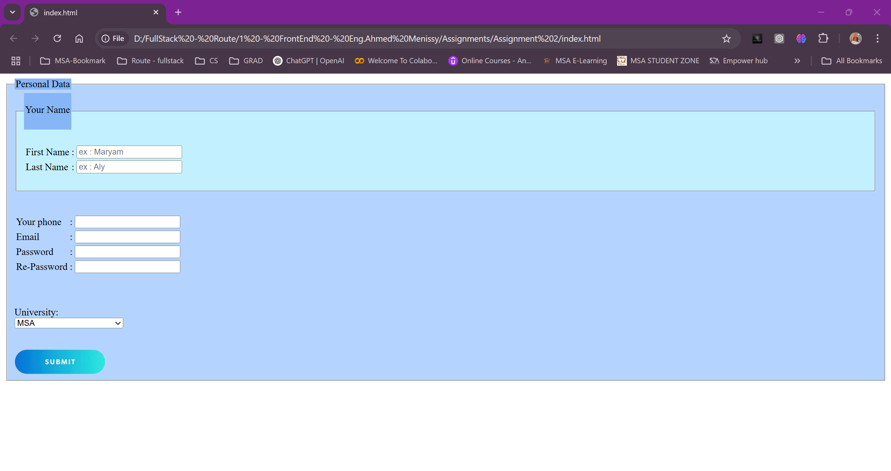

# Personal Data Collection Form  

A simple, structured HTML form to collect user details such as name, contact information, and university selection.

## Preview  

  

## Technologies Used  

- **HTML** for structure  
- **Basic CSS styling** (inline styles)  
- **Form elements** for user input  

## Features  

✅ User-friendly form layout  
✅ Dropdown menu for university selection  
✅ Submit button with an image  

## Possible Enhancements  

🔹 Add CSS for better design  
🔹 Implement form validation using JavaScript  
🔹 Connect it to a database for data storage  
